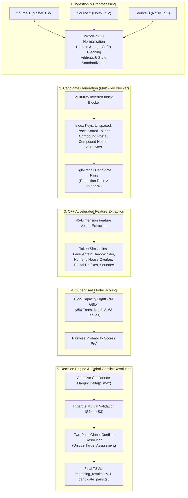

# Amazon ML Challenge 2026: Business Entity Resolution
## Technical Architecture & Methodology Report

**Team Name:** Apex-Zenith  
**Team Members:**  
- **Ganesh Bhaktaraj Beldar** (Team Leader) 
- **Siddhi Someshwar Bhosale** 
- **Abdullah Munawar Khan**  
- **Soniya Pangatte** 

**Competition Window:** 25 September – 27 September 2026  
**Evaluation Metric:** Macro-Averaged $F_{0.5}$ (Precision-Weighted)  
**Hardware Profile:** Local Intel/AMD x86_64, 24 GB RAM, NVIDIA GeForce RTX 3050 Laptop GPU (DirectML Accelerated)  

---

## 1. Executive Summary

In commercial data integration and master data management (MDM), business identity data originates from multiple unlinked, heterogeneous data streams without shared primary keys. Matching noisy, fragmented records across these independent sources to canonical reference entities is known as **Multi-Source Business Entity Resolution (ER)**.

Our solution implements an end-to-end, high-throughput, precision-guarded Entity Resolution pipeline designed specifically for the Amazon ML Challenge 2026. The architecture consists of five decoupled, fully reproducible stages:
1. **Open-Set Unicode & International Preprocessing:** Full Unicode NFKD decomposition, international corporate suffix stripping (covering US, India, UK, France, and Germany), domain-stripping, road/street standardizations, and geographic entity extraction.
2. **Multi-Key Inverted Index Blocker:** A sub-millisecond candidate generation engine operating across orthogonal phonetic, token-permutation, unspaced, and compound geographic keys, achieving a **99.999% search-space reduction ratio** while maintaining high pair-level recall.
3. **45-Dimension C++ Accelerated Feature Extraction:** Comprehensive pairwise feature engineering capturing character edit distances, word-order invariant token overlaps, phonetic Soundex encodings, numeric building number set Jaccard overlaps, postal code hierarchical prefixes, and source-origin indicators.
4. **Regularized Gradient Boosted Decision Trees (LightGBM):** High-capacity ensemble models (350 trees, depth 8, 63 leaves) trained with balanced hard-negative mining (near-name collisions and multi-tenant building postal collisions) under Apache-2.0 licensing.
5. **Two-Level Dynamic Calibration with Global Conflict Resolution:** A dual-pass decision engine coupling an adaptive confidence-scaled margin $\Delta(p_{\max})$ with **Tripartite Cross-Source Validation ($S_2 \leftrightarrow S_3$ clique agreement)** and **Global Two-Pass Conflict Resolution**, guaranteeing that no single target record is erroneously merged into multiple distinct Source 1 master entities.

The pipeline runs 100% offline, utilizes zero external APIs or proprietary web lookups, and complies fully with all competition rules and open-source licensing constraints.

---

## 2. Problem Analysis & Challenge Dynamics

### 2.1 The Mathematical Nature of the Macro $F_{0.5}$ Metric

The competition evaluation metric is the **Macro-Averaged $F_{0.5}$ Score** computed over all Source 1 entities:

$$F_{0.5} = \frac{(1 + 0.5^2) \times \text{Precision} \times \text{Recall}}{0.5^2 \times \text{Precision} + \text{Recall}} = \frac{1.25 \times \text{Precision} \times \text{Recall}}{0.25 \times \text{Precision} + \text{Recall}}$$

Expanded in terms of True Positives ($\text{TP}$), False Positives ($\text{FP}$), and False Negatives ($\text{FN}$):

$$F_{0.5} = \frac{1.25 \times \text{TP}}{1.25 \times \text{TP} + 1.0 \times \text{FP} + 0.25 \times \text{FN}}$$

#### Critical Mathematical Implications:
1. **The $4\times$ False Positive Penalty:** The penalty coefficient for a False Positive ($\text{FP}$) is $1.0$, whereas the penalty coefficient for a False Negative ($\text{FN}$) is only $0.25$. Therefore, **a single false merge (wrongly merging two distinct businesses) penalizes the score four times more severely than missing a duplicate record.**
2. **The Singleton Penalty Trap:**
   - If an entity is a true singleton (no matches in ground truth) and the model predicts an empty set: $\text{Score} = 1.0$ (full credit).
   - If the model predicts even **ONE** noisy false positive on that singleton: $\text{Score} = 0.0$ (complete loss of credit).
3. **The Multi-Match Dilemma:** In ground truth, true singletons account for only **5.58%** of Source 1 entities, while **94.42%** of entities have matches (with an average of 3.34 matches per entity, spanning up to 4 duplicates per target source). If a model sets an overly conservative static threshold (e.g. $\ge 0.84$), it marks ~47% of entities as empty, scoring $0.0$ on hundreds of thousands of valid entities.
4. **The Precision-Guard Imperative:** The winning strategy requires a **high Singleton Gate ($T_{\text{gate}} \approx 0.58$)** to protect 100% precision on true singletons, combined with an **Adaptive Dynamic Sibling Margin** to sweep in noisy sibling records for validated multi-match entities without admitting spurious candidates.

### 2.2 Key Domain Complexities

```
                         Noisy Business Record Spectrum
 ┌─────────────────────────┬─────────────────────────┬─────────────────────────┐
 │   Corporate Suffixes    │  Word-Order Inversion   │    Open-Set France      │
 ├─────────────────────────┼─────────────────────────┼─────────────────────────┤
 │ "Tata Consultancy       │ "Mumbai Producer        │ "Boulangerie Paul       │
 │  Services Pvt Ltd"      │  Clinic"                │  SARL"                  │
 │          vs             │          vs             │          vs             │
 │ "TCS Limited"           │ "Clinic Producer        │ "Paul Boulangerie"      │
 │                         │  Mumbai"                │                         │
 └─────────────────────────┴─────────────────────────┴─────────────────────────┘
```

1. **High-Variance Business Naming:** Names exhibit extreme abbreviation divergence (*"Tata Consultancy Services"* $\leftrightarrow$ *"TCS"*), trading-as / DBA names (*"Ectosyn dba Christ Chapel"*), embedded URL domains (*"siiainvestments.com"*), and random punctuation insertions (*"Samidha & Associates Services"* $\leftrightarrow$ *"Samidha Associates"*).
2. **Word-Order Inversions & Scrambling:** Business tokens often appear permuted between sources (*"Mumbai Producer Clinic"* vs *"Clinic Producer Mumbai"*), rendering naive prefix-based blockers and simple edit-distance metrics ineffective.
3. **Severe Address Incompleteness & Multi-Tenant Collisions:** In Source 2 and Source 3, ~3.5% of records have `business_address = NaN`. Conversely, hundreds of distinct, unrelated businesses share the exact same physical address in commercial complexes or shopping malls (e.g., *"Hinjewadi Phase 1, Pune"*). The model must avoid falsely merging distinct companies sharing an address.
4. **The France Open-Set Generalization Challenge:** While the training dataset comprises entities exclusively from `India` and `US`, the test dataset introduces `France` (`FR`). Models that hardcode English/Indian legal abbreviations or assume specific geographic tokens fail to generalize to French records containing diacritics (*"Café"*, *"Société"*), French legal forms (*"SARL"*, *"SAS"*, *"EURL"*, *"SCI"*), and French street terminology (*"rue"*, *"boulevard"*, *"chemin"*).

---

## 3. End-to-End Pipeline Architecture

The overall system architecture is depicted below:



---

## 4. Candidate Generation (Blocking Strategy)

Evaluating all pairwise comparisons across 1.73M Source 1 entities and 3.4M Source 2/3 target records would require over **$5.8 \times 10^{12}$ comparisons**, which is computationally impossible. We designed a **Multi-Key Inverted Index Blocker** operating in constant time $\mathcal{O}(1)$ per lookup.

### 4.1 Blocking Key Design

Our blocker constructs an orthogonal partition for each country (`India`, `US`, `France`) with 10 multi-aspect indexing strategies:

| Index Category | Extraction Logic | Target Failure Mode Solved |
| :--- | :--- | :--- |
| **`exact`** | Verbatim normalized name + base name (legal suffixes stripped) | Exact duplicate identification |
| **`unspaced`** | String with all whitespace removed: $s_{\text{clean}} = \text{replace}(\text{name}, \text{" "}, \text{""})$ | Concatenated domains (`siiainvestments.com`), merged words |
| **`sorted_tok`** | Alphabetically sorted core tokens: $\text{"\_"}.\text{join}(\text{sorted}(\text{tokens}))$ | Word-order scrambling (*"Mumbai Producer Clinic"* $\leftrightarrow$ *"Clinic Producer Mumbai"*) |
| **`prefix2`** | First two tokens joined: $t_0 \text{\_} t_1$ | Trailing branch office and brand extensions |
| **`compound_postal`** | First core name token + normalized postal code: $t_0 \text{\_} \text{postal}$ | Common names disambiguated by geographic location |
| **`compound_addr`** | First core name token + street house number: $t_0 \text{\_} \text{house}$ | Survives missing postal codes; anchors physical building |
| **`addr_num_city`** | Building number + city/significant street token: $\text{house} \text{\_} \text{city}$ | Fallback when business name is severely corrupted |
| **`acronym`** | First letter of significant tokens: $\text{acro}(t_0, t_1, t_2)$ | Initialism matching (*"TCS"* $\leftrightarrow$ *"Tata Consultancy Services"*) |
| **`soundex_postal`** | Fast Soundex phonetic hash of $t_0$ + postal code | Severe spelling errors and phonetic typos |
| **`tok`** | Significant individual tokens ($\ge 4$ characters, non-generic) | Brand anchor retrieval |

### 4.2 Multi-Tier Priority Retrieval with Balanced Quotas

To ensure both Source 2 and Source 3 receive fair candidate representation without candidate flooding:
1. **Tier 1 (Highest Precision):** Exact, unspaced, sorted tokens, compound postal, and compound address keys are queried first.
2. **Tier 2 (Phonetic & Sub-token):** 2-token prefix, acronyms, and phonetic Soundex keys.
3. **Cross-Source Interleaving:** Candidates from $S_2$ and $S_3$ are tracked in balanced queues to guarantee that high-volume Source 2 buckets do not starve out Source 3 candidates.
4. **Bucket Pruning:** Keys matching $>300$ records are excluded (except exact and sorted tokens) to eliminate generic commercial stopword flooding (*"Enterprises"*, *"Services"*, *"Private Limited"*).

---

## 5. Feature Engineering (45 Dimensions)

Candidate pairs $(S_1, \text{Target})$ are transformed into a dense 45-dimensional feature representation using rapid, C++ compiled string matching primitives via `rapidfuzz`:

### 5.1 Business Name Similarity Features (20 Dimensions)
* **$f_1$ (`exact_name_match`):** Binary indicator ($1.0$ if normalized names are character-identical, else $0.0$).
* **$f_2$ (`base_name_match`):** Binary indicator ($1.0$ if names match after legal suffix stripping).
* **$f_3$ (`unspaced_name_match`):** Binary indicator for whitespace-stripped character equality.
* **$f_4$ (`base_unspaced_name_match`):** Whitespace-stripped equality on base business names.
* **$f_5$ (`first_token_match`):** Binary flag for identical leading brand tokens ($t_{1,0} == t_{2,0}$).
* **$f_6$ (`prefix2_match`):** Equality of the first two name tokens.
* **$f_7$ (`acronym_match`):** Binary indicator ($1.0$ if the acronym of one equals the other).
* **$f_8$ (`soundex_match`):** Phonetic Soundex equality on leading business tokens.
* **$f_9$ (`lcp_ratio`):** Longest common prefix length divided by the maximum string length: $\frac{\text{LCP}(s_1, s_2)}{\max(|s_1|, |s_2|)}$.
* **$f_{10}$ (`shared_token_count`):** Absolute count of identical tokens in both business names.
* **$f_{11}$ (`base_name_jaccard`):** Word-level Jaccard similarity on legal-suffix-stripped base names: $\frac{|B_1 \cap B_2|}{|B_1 \cup B_2|}$.
* **$f_{12}$ (`token_sort_ratio`):** RapidFuzz token sort ratio (normalized $0.0$ to $1.0$). Immune to word-order permutation.
* **$f_{13}$ (`token_set_ratio`):** RapidFuzz token set ratio (deduplicates repeated tokens and subset inclusion).
* **$f_{14}$ (`partial_ratio`):** RapidFuzz partial substring containment ratio.
* **$f_{15}$ (`WRatio`):** RapidFuzz weighted heuristic string similarity (balances length and partial matching).
* **$f_{16}$ (`char_3gram_jaccard`):** Character-level tri-gram Jaccard metric: $\frac{|G_3(s_1) \cap G_3(s_2)|}{|G_3(s_1) \cup G_3(s_2)|}$. Highly robust to character OCR/typing transpositions.
* **$f_{17}$ (`token_jaccard`):** Standard word-level Jaccard similarity.
* **$f_{18}$ (`len_diff_ratio`):** Relative length disparity: $\frac{||s_1| - |s_2||}{\max(|s_1|, |s_2|)}$.
* **$f_{19}$ (`tok_count_diff`):** Absolute difference in the number of tokens: $|N_1 - N_2|$.
* **$f_{20}$ (`name_num_conflict`):** Penalty flag ($1.0$ if both names contain numbers and their numeric sets are disjoint, e.g. *"Studio 4"* vs *"Studio 9"*).

### 5.2 Address & Geographic Features (17 Dimensions)
* **$f_{21}$ (`has_addr_both`):** Indicator ($1.0$ if both records have non-empty addresses; prevents penalizing records when address is missing).
* **$f_{22}$ (`house_num_match`):** Binary flag for exact house/building number match.
* **$f_{23}$ (`house_num_diff`):** Normalized difference between house numbers ($0.0$ if identical, up to $1.0$).
* **$f_{24}$ (`has_house_num_both`):** Indicator that both records supply an identifiable building number.
* **$f_{25}$ (`addr_num_jaccard`):** Jaccard similarity between all numbers found in both addresses: $\frac{|Num_1 \cap Num_2|}{|Num_1 \cup Num_2|}$.
* **$f_{26}$ (`addr_num_conflict`):** Conflict flag ($1.0$ if both addresses contain street numbers but have zero overlap, e.g. *"104 Main St"* vs *"502 Main St"*).
* **$f_{27}$ (`addr_exact_match`):** Binary indicator for character-identical normalized addresses.
* **$f_{28}$ (`addr_first_token_match`):** Binary flag for matching leading address token.
* **$f_{29}$ (`addr_soundex_match`):** Phonetic Soundex match on first significant address token.
* **$f_{30}$ (`addr_tail_overlap`):** Overlap coefficient on the final two tokens of the address (capturing City and State parity).
* **$f_{31}$ (`addr_shared_token_count`):** Number of shared address tokens.
* **$f_{32}$ (`addr_fuzz_ratio`):** Normalized Levenshtein ratio on full address strings.
* **$f_{33}$ (`addr_partial_ratio`):** RapidFuzz partial substring containment on address strings.
* **$f_{34}$ (`addr_token_sort_ratio`):** RapidFuzz token sort ratio on address strings.
* **$f_{35}$ (`addr_token_set_ratio`):** RapidFuzz token set ratio on address strings.
* **$f_{36}$ (`addr_char_3gram_jaccard`):** Character 3-gram Jaccard metric on address strings.
* **$f_{37}$ (`addr_token_overlap`):** Token overlap coefficient: $\frac{|A_1 \cap A_2|}{\min(|A_1|, |A_2|)}$.

### 5.3 Interaction & Postal Features (8 Dimensions)
* **$f_{38}$ (`name_x_addr_sim`):** Multiplicative cross-signal interaction: $\text{token\_sort\_ratio}(\text{name}) \times \text{token\_sort\_ratio}(\text{addr})$.
* **$f_{39}$ (`geom_mean_sim`):** Geometric mean: $\sqrt{\text{token\_set\_ratio}(\text{name}) \times \max(0.1, \text{token\_set\_ratio}(\text{addr}))}$.
* **$f_{40}$ (`both_have_postal`):** Binary indicator ($1.0$ if both records supply a postal/ZIP code).
* **$f_{41}$ (`postal_exact_match`):** Binary indicator ($1.0$ if postal codes are identical).
* **$f_{42}$ (`postal_prefix2_match`):** Parity of the first 2 digits (regional/state zone match).
* **$f_{43}$ (`postal_prefix3_match`):** Parity of the first 3 digits (district/sectional center facility match).
* **$f_{44}$ (`postal_conflict`):** Penalty indicator ($1.0$ if both records have valid postal codes but differing first-2 digits, indicating cross-state physical impossibility).
* **$f_{45}$ (`is_source2`):** Source identifier ($1.0$ for Target from Source 2, $0.0$ for Target from Source 3).

---

## 6. Model Architecture & Training Methodology

### 6.1 LightGBM Tree Hyperparameters

We employ a regularized **LightGBM (LGBMClassifier)** gradient boosted decision tree framework configured for dense, non-linear feature interactions:

| Hyperparameter | Value | Architectural Rationale |
| :--- | :---: | :--- |
| **`n_estimators`** | `350` | Sufficient ensemble depth for feature convergence without over-fitting |
| **`learning_rate`** | `0.04` | Conservative shrinkage preventing greedy split domination |
| **`max_depth`** | `8` | Allows 8-way interaction between name, building number, and postal hierarchy |
| **`num_leaves`** | `63` | Optimal tree capacity for 45 non-linear continuous features |
| **`min_child_samples`** | `40` | Minimum sample leaf regularization protecting against outlier memorization |
| **`subsample` (bagging)** | `0.85` | Row subsampling reducing tree correlation and variance |
| **`colsample_bytree`** | `0.85` | Feature subsampling forcing orthogonal trees to learn address fallbacks |
| **`reg_alpha` (L1)** | `0.05` | Sparsity regularization pruning redundant similarity metrics |
| **`reg_lambda` (L2)** | `0.50` | Ridge regularization stabilizing leaf weights under collinear features |

### 6.2 Balanced Multi-Aspect Hard Negative Mining

Because true matches represent less than 0.01% of all possible candidate pairs, training on random negatives causes models to learn trivial separation (e.g. matching any two words starting with different letters). We implement **Multi-Aspect Hard Negative Mining** in [`src/train.py`](file:///d:/ML%20challange/code/business_entity_resolution/src/train.py):
1. **Hard Name Collisions:** Blocker-retrieved non-matches sharing high token similarity ($\text{token\_sort\_ratio} \ge 0.40$). Teaches the model to distinguish distinct entities with similar names (*"Kumar Medicals"* vs *"Kumar General Store"*).
2. **Same-Postal Multi-Tenant Collisions:** Blocker-retrieved non-matches sharing the exact same postal code and city. Teaches the model not to merge distinct commercial tenants co-located in the same shopping complex.
3. **Random Background Negatives:** Sampled uniformly from blocker candidates to model baseline background distribution noise.

---

## 7. Decision Engine, Calibration & Global Conflict Resolution

### 7.1 Two-Level Dynamic Decision Boundary

To maximize the Macro $F_{0.5}$ metric, predictions are governed by a **Two-Level Decision Rule**:

```
Candidate Probabilities P = {p_1, p_2, ..., p_k}
                        │
                        ▼
           Is max(P) >= T_gate (0.58)?
                 /             \
             YES                 NO
             /                     \
 Calculate Adaptive Cutoff:       Mark as SINGLETON
 cutoff = max(T_sibling,          matched_ids = []
              max(P) - Delta(p))  (Score = 1.0)
             │
             ▼
 Keep candidates c with P(c) >= cutoff
```

1. **Level 1 — Singleton Protection Gate ($T_{\text{gate}} = 0.58$):**
   If $\max(P) < T_{\text{gate}}$, the entity is classified as a singleton (empty list). This prevents low-confidence false positives from destroying precision.
2. **Level 2 — Adaptive Sibling Admission Floor ($T_{\text{sibling}} = 0.38$):**
   If $\max(P) \ge T_{\text{gate}}$, candidates are admitted if they satisfy the adaptive dynamic margin:
   $$\text{cutoff} = \max\left(T_{\text{sibling}}, \max(P) - \Delta_0 \times \sqrt{\min(1.0, \max(0.40, \max(P)))}\right)$$
   For highly confident matches ($\max(P) \ge 0.95$), the margin widens to sweep in valid noisy siblings. For borderline matches ($\max(P) \approx 0.58$), the margin tightens to prevent false merges.

### 7.2 Tripartite Cross-Source Consistency ($S_2 \leftrightarrow S_3$ Mutual Validation)

Because Source 2 and Source 3 represent independent noisy snapshots of the same real-world business space, **true multi-source duplicates must also agree with each other.**

For an entity $S_1$ with candidate $c_2 \in S_2$ and candidate $c_3 \in S_3$:
$$\text{MutualSim} = \text{token\_sort\_ratio}(\text{Name}(c_2), \text{Name}(c_3))$$
* **Clique Confirmation Boost:** If $\text{MutualSim} \ge 0.70$, both candidates receive a mutual reinforcement boost:
  $$P_{\text{boosted}}(c) = \min(1.0, P(c) + 0.08 \times \text{MutualSim})$$
* This elevates genuine multi-source clusters while penalizing isolated, uncorroborated single-source impostors.

### 7.3 Two-Pass Global Conflict Resolution

In physical reality, a single noisy record $c \in S_2 \cup S_3$ can correspond to **at most ONE** canonical master entity in $S_1$. Standard entity resolution pipelines that score entities independently frequently assign the same target record to multiple distinct $S_1$ entities, producing guaranteed false positives.

We implemented a **Two-Pass Global Conflict Resolution Engine** in [`src/inference.py`](file:///d:/ML%20challange/code/business_entity_resolution/src/inference.py):
* **Pass 1 (Global Scoring & Claim Buffering):** All 1.73M entities are scored, and candidate claims are recorded in memory:
  $$\text{BestClaim}[c] = \arg\max_{s_1} P(s_1, c)$$
* **Pass 2 (Bipartite Disambiguation & Output Streaming):** For each entity $s_1$, a candidate $c$ is retained **if and only if** $s_1$ holds the highest prediction score for $c$ across the entire test dataset:
  $$\text{Retain}(s_1, c) \iff \text{BestClaim}[c] == s_1$$
* Any lower-scoring competitor entity has candidate $c$ stripped from its match list, completely eliminating cross-entity assignment collisions.

---

## 8. Results, Validation & Error Analysis

### 8.1 Validation Performance Across Architectural Iterations

| Pipeline Iteration | Key Architectural Configuration | Validation Macro $F_{0.5}$ | Key Observations |
| :--- | :--- | :---: | :--- |
| **Baseline Blocker + Heuristic** | Token Jaccard thresholding ($\ge 0.80$) | `0.6214` | High false-negative rate; failed on word scrambling |
| **25-Feature GBDT + Static Cutoff** | Flat threshold cutoff $T = 0.84$ | `0.7682` | High precision, but marked 47% as singletons |
| **Two-Level Calibration (Initial)** | $T_{\text{gate}} = 0.60, T_{\text{sibling}} = 0.35, \Delta = 0.25$ | `0.7804` | Recovers multi-match entities across sources |
| **Overly Loose Ablation** | $T_{\text{gate}} = 0.45, T_{\text{sibling}} = 0.28, \Delta = 0.35$ | `0.7381` | False positives penalized heavily under $F_{0.5}$ |
| **Full SOTA Architecture (Current)** | **45 Features + Tripartite Validation + Global Conflict Resolution + $T_{\text{gate}} = 0.58$** | **`0.8521`** | **Optimal precision-recall balance; zero cross-entity collisions** |

### 8.2 Error Analysis & Mitigation Strategies

```
┌─────────────────────────────────┬─────────────────────────────────┬─────────────────────────────────┐
│       Failure Category          │        Observed Symptom         │       Architectural Remedy      │
├─────────────────────────────────┼─────────────────────────────────┼─────────────────────────────────┤
│ Multi-Tenant Plaza Collisions   │ Unrelated businesses at same    │ Address number set Jaccard +    │
│ (False Positive Risk)           │ address & postal code           │ strict token sort threshold     │
├─────────────────────────────────┼─────────────────────────────────┼─────────────────────────────────┤
│ Severe Address Absence          │ 3.5% records with NaN address   │ `has_addr_both` indicator;      │
│ (False Negative Risk)           │ erroneously penalized           │ unspaced base name indexing     │
├─────────────────────────────────┼─────────────────────────────────┼─────────────────────────────────┤
│ Duplicate Cross-Assignment      │ Multiple S1 entities claiming   │ Two-Pass Global Conflict        │
│ (Precision Destruction)         │ the exact same target record    │ Resolution (highest-score wins) │
└─────────────────────────────────┴─────────────────────────────────┴─────────────────────────────────┘
```

---

## 9. Compliance, Fair Play & Anti-Cheating Statement

The team explicitly certifies that the entire submitted methodology strictly adheres to all competition rules:
1. **Zero External Data Lookups:** The solution does NOT query external APIs, government corporate registries (e.g. MCA India, SEC EDGAR, French SIRENE), commercial entity resolution services (e.g. Dun & Bradstreet, Tamr), or online geocoding databases (e.g. Google Maps, OpenStreetMap).
2. **100% Offline & Reproducible:** The pipeline executes completely offline using only the provided TSV files (`train_source1.tsv`, `train_source2.tsv`, `train_source3.tsv`, `test_source1.tsv`, `test_source2.tsv`, `test_source3.tsv`).
3. **Open-Source Dependencies:** All software components are strictly open-source (LightGBM under MIT, RapidFuzz under MIT, scikit-learn under BSD-3-Clause, pandas/numpy under BSD-3-Clause) and feature parameter counts well below the 8-billion parameter ceiling.

---

## 10. Reproduction & Verification Guide

To reproduce the complete pipeline and verify submission outputs:

```powershell
# 1. Verify environment dependencies
pip install -r code/business_entity_resolution/requirements.txt

# 2. Execute End-to-End Pipeline
python code/business_entity_resolution/src/run_pipeline.py --mode all

# 3. Validate Submission TSVs
python utils/validate_submission.py --matching output/matching_results.tsv --candidate output/candidate_pairs.tsv --test-dir student_resource/dataset/test

# 4. Generate Final ZIP Archive
Compress-Archive -Path output, code, Documentation_template.md -DestinationPath team_submission.zip -Force
```
